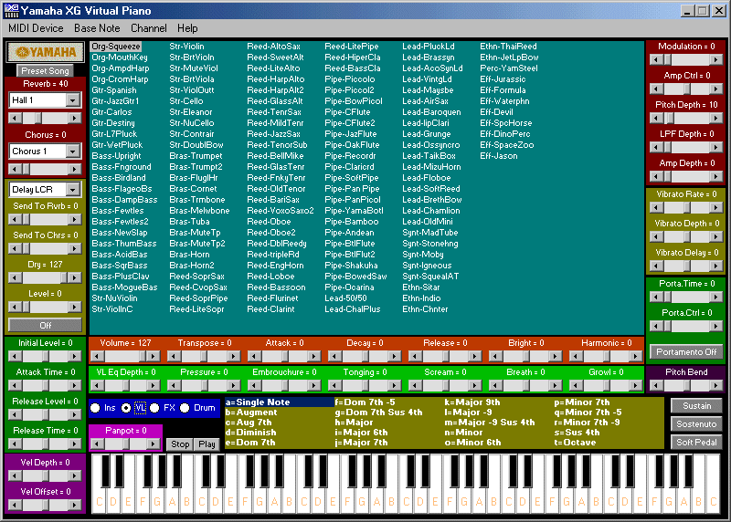



## Virtual Piano Updated\!

### Description

Shows how to create a virtual piano, selecting MIDI devices, selecting channel, playing notes, selecting instrument voice, sending controller messages, making pitch wheel for instrument voice, sending System Exclusive header, etc.

Notes for XG Piano : You must have Yamaha XG compatible sound card or you may use Yamaha SYXG 100 Soft Synth as midi output driver.
 
### More Info
 

             |
---                |---
**Submitted On**   |2001-04-21 10:23:40
**By**             |[Millennium](https://github.com/Planet-Source-Code/PSCIndex/blob/master/ByAuthor/millennium.md)
**Level**          |Beginner
**User Rating**    |5.0 (99 globes from 20 users)
**Compatibility**  |VB 5\.0, VB 6\.0
**Category**       |[Complete Applications](https://github.com/Planet-Source-Code/PSCIndex/blob/master/ByCategory/complete-applications__1-27.md)
**World**          |[Visual Basic](https://github.com/Planet-Source-Code/PSCIndex/blob/master/ByWorld/visual-basic.md)
**Archive File**   |[Virtual Pi186214212001\.zip](https://github.com/Planet-Source-Code/millennium-virtual-piano-updated__1-7311/archive/master.zip)

